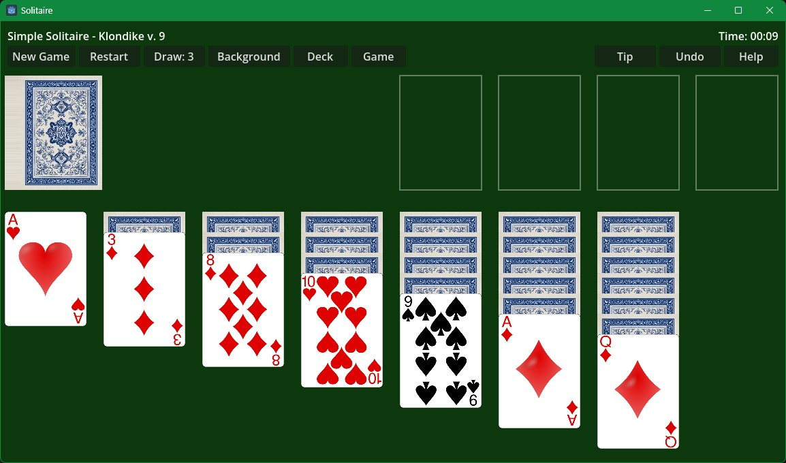

# Simple Solitaire

A clean, no-frills solitaire game built with Godot 4. Includes **Klondike** and **Spider** (1, 2, or 4 suit).



## Games

- **Klondike** — the classic. Build the four foundations up by suit, Ace to King.
- **Spider** — build eight King-to-Ace runs of a single suit. Choose 1, 2, or 4 suits for easy/medium/hard.

Switch between games from the **Game** button.

## Features

- Klondike and Spider (1/2/4 suit) in one app
- **Tip** button — highlights a legal move with a yellow arrow; click again to cycle through other moves
- **Restart** — replay the same deal or start a new one
- **Undo** any number of moves
- Game **timer** (top right)
- **Deck** options — blue, red, or cowboy card back, plus a normal or cowboy face set
- Customizable **background** color
- Win detection with an on-screen message

## Controls

| Action | Control |
|--------|---------|
| Move a card / run | Left-click and drag |
| Send a card to a foundation (Klondike) | Click the card |
| Pan the table | Right-click and drag |
| Zoom | Mouse wheel |
| Show a hint | Tip button |

## How to Play

**Klondike** — Click the draw pile to deal to the waste (use **Draw** to toggle 1 or 3 cards). Build tableau columns down in alternating colors; only a King fills an empty column. Click a playable card to auto-send it to a foundation. Face-down cards flip when exposed. Win by completing all four foundations.

**Spider** — Build columns down in rank (any suit). A group of cards only moves together if it's the same suit in descending order. Click the stock to deal one card to every column (all columns must be non-empty first). Complete runs are removed automatically. Win by clearing all eight runs.

## Downloads

Pre-built binaries are on the [Releases](https://github.com/IronWolve/Simple_Solitaire/releases) page.

| Platform | File |
|----------|------|
| Windows | `Solitaire_win.zip` — extract and run `Solitaire.exe` |
| Linux (x86_64) | `Solitaire_linux.zip` — extract and run `Solitaire.x86_64` |
| macOS (Universal) | `Solitaire_macos.zip` — extract and run `Simple Solitaire.app` |

> **macOS:** Not notarized — on first launch, right-click → Open to bypass Gatekeeper.

## Building from Source

Requires [Godot 4.6](https://godotengine.org/) with export templates installed. See [RELEASES.md](RELEASES.md) for full build and packaging instructions.

```bash
godot4 --headless --export-release "Windows Desktop" build/Solitaire.exe
```

## License

MIT License — based on [godotSolitaire](https://github.com/blackears/godotSolitaire) by Mark McKay.
